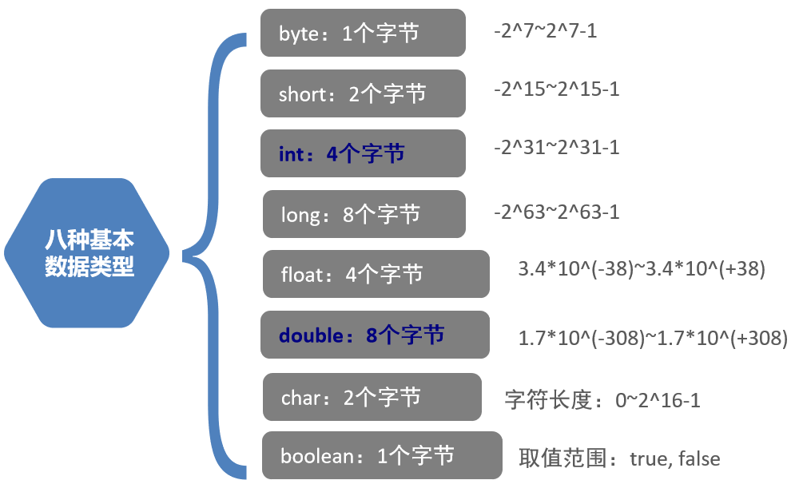

# JAVA Cookbook

### IDEA 常用快捷键
> Alt+shift+上下方向键 移动当前代码行（选中的代码块）  
> ctrl+N 当前项目中的文件过多时，方便快速查找定位文件  
> ctrl+D 复制光标所在行（选中的代码块）  
> ctrl+Y 删除光标所在行（选中的代码块）  
> Ctrl+ALT+L 针对当前的代码进行代码格式化 
> ALT+Enter 在IDEA中当书写程序时，遇到红色提示时可以使用该快捷键来解决该提示问题 

### 常量
- 字符常量
    - 字符和字符串
        - 字符使用单引号，如 'A'
        - 字符串使用双引号，如"ABC"
- 字符串常量
- 布尔常量
    - True or False
- 空常量
    - null                  
    - 不能通过输出语句直接打印
    
### 变量
在程序运行过程中可以改变的量  
变量的定义格式: 数据类型 变量名=变量值 如 int a=10；    

### 数据类型
Java是一门**强类型**语言：在定义变量时就指定了变量的具体类型，在程序运行过程中无法对变量的类型进行修改
弱类型:Scala语言
- 基本数据类型
    - 整数
        - byte     一个字节，取值范围:-128~127
        - short   两个字节， 15次方
        - 默认 int   四个字节，31次方
        - long    八个字节
            - 为了区分，在值末尾加上L
    - 小数
        - float 四个字节，单精度浮点数 默认六到八位
        - 默认 double 八个字节，双精度浮点数 
    - 字符
        - char 两个字节， 英文单引号包含的单个字符
    - 布尔Boolean 一个字节
        - True
        - False
    
- 引用数据类型
    - 类
    - 接口
    - 数组[]

- 标识符
给程序中变量、类、方法、数组等起的名字
要求(命名规则):
    - 标识符只能由:大小字母、数字、下划线、$组成
    - 必须是以：英文字母或下划线或$开头（不能是数字开头）
    - 不能是Java中的关键字
- 命名规范:    
    - 类名、接口的命名规范:大驼峰命名法
    - 变量、方法的命名规范:小驼峰命名法
    - 包的命名全部都以小写字母为主，通常名称是使用域名倒着写    
    
    
### 类型转换
- 自动类型转换(隐式类型转换)
    - 原则:小类型转换为大类型
        byte -> short int long float double 
        short -> int  long float double
        int -> long float double
        float -> double 
        char -> int -> long
- 强制类型转换(显示类型转换)    
    - 原则: 在程序中，把大类型转换为小类型，不能自动转换，需要手动强制进行转换
    格式: 小类型名 变量=(小类型名) 大类型的运算结果
    
### 运算符
- 在Java中任何数据类型和字符串相加，"+"的作用都变成了拼接，其结果都是拼接字符串
    - 例:S.o.p("5+5"+5+5); 输出是5+5=55
    - 而S.o.p("5+5"+(5+5));结果才是5+5=10     
- 在Java中一元运算的优先级高于二元运算    
    - 一元运算
        - 自增
            - 只能用于变量
            - b = a++ 先赋值,再参与运算
            - b = ++a 先参与运算，再赋值
        - 自减
            - 道理同自增
    - a += 1之类的计算结果等同于  a = a+1
    - 但是内部机制并不是如此:
        short s=1;
        s += 10;
        其实等价于
        short s=1;
        s = (short) (s+10);
    - 二元运算
        - 加、减、乘、除、取余           

- 逻辑运算符
只能针对Boolean进行运算 
    - **短路与**&&
        - 作用：等同于逻辑与(&)
        - 特殊之处:
            - 当&&之前的运算结果为false时，其后面的运算不会再执行(在与操作中已经得到了一个否，则结果必为否)。
            - 执行速度更快
    - **短路或**||   
        - 作用:等同于逻辑或(|)
        - 特殊之处:
            - 当||之前的结果为false时，其后面的表达式便不会再执行
            - 速度更快
    
- 三元运算符
格式:  
数据类型 变量名 = (关系表达式) ? 表达式1:表达式2  
> 变量接收的是表达式1的运算结果或者是表达式2的运算结果
> 如果关系表达式为true，则执行表达式1
> 如果关系表达式为false，则执行表达式2

- 键盘录入
试用步骤:
    - 1.导入Scanner包 import java.util.Scanner;
    - 2.创建Scanner对象,Scanner sc = new Scanner(System.in);
    - 3.获取键盘录入的数据:
        如:String str = sc.next(); 
        如:int num = sc.nextInt();
    
### 分支结构
- switch语句
    - 当判断的条件不是进行区间比较时，仅只是进行两个数据之间相等的比较时
    - switch之后的括号里可以接收变量、常量和表达式
    需要确保其类型必须是byte、short、int、char、String或枚举
    - default可以书写在任何位置，但除了末尾的位置都必须写break
    - case穿透现象
    - **假设表达式的值 = 值1, 则执行完语句体1后, 不会判断第二个case, 直接执行语句体2**
        ~~~java
        witch(表达式){
            case 值1: 	
                语句体1;	//假设表达式的值 = 值1, 则执行完语句体1后, 不会判断第二个case, 直接执行语句体2;
            case 值2:
                语句体2;
                break;
            case 值3:
                语句体3;
                break;
                  ...    //根据需求, 可以写多组case.
            default:	
                语句体n;
                break;
      }
        ~~~
    - 案例 SwitchPenetrate.java
### 循环
- 三种循环
    - for循环
        - 流程
            - 1.执行循环初始值
            - 2.判断循环条件是否满足
            - 3.执行for循环体重的代码
            - 4.修改循环条件中的值
            - 重复2、3、4
            - 直到不满足循环条件
        - 特点:
            - 先判断，再执行循环体
        - 句式语法
            - ~~~java
              for(循环初始值;循环条件;循环条件中值的修改)
              {
                  code block;
              }
              ~~~
    - while循环
    - do...while循环
- 循环三要素
    - 循环初始值
    - 循环条件
    - 循环条件中值的修改(修改循环条件)  
- 循环差异
    - 在for循环执行完之后，无法使用for循环里的初始化条件，比如循环执行过程中自动改变的变量
    - 而在while循环执行完之后，他的循环条件却还可以使用         
    
    
    